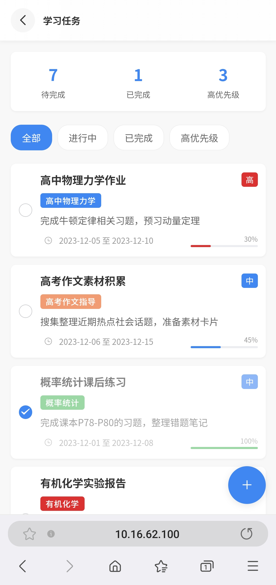
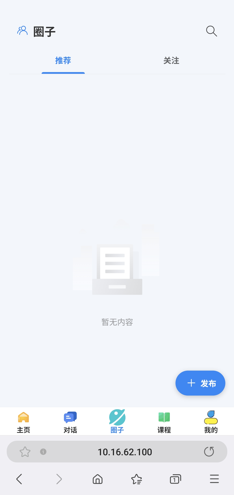
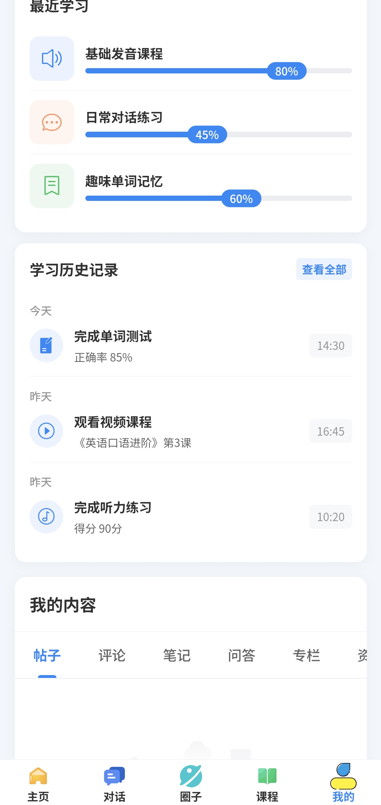
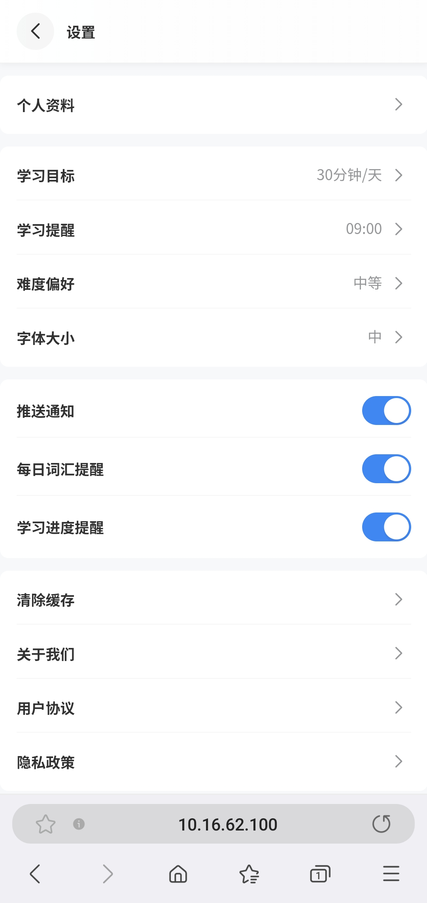

# 智云星课 - 智能学习平台

## 项目简介

智云星课是一个基于Vue3和TypeScript构建的移动端智能学习平台，融合了AI对话、课程学习、单词记忆等功能，为用户提供全方位的学习体验。


## 技术栈

- **前端框架**: Vue 3.5
- **状态管理**: Pinia 3.0
- **路由**: Vue Router 4.5
- **UI组件库**: Vant 4.9
- **HTTP请求**: Axios
- **构建工具**: Rsbuild
- **语言**: TypeScript
- **代码规范**: ESLint, Prettier, Biome

## 相关项目

- **后端仓库**: [smartclass-backend](https://github.com/Ubanillx/smartclass-backend) - 基于Spring Boot的后端服务
- **管理端仓库** [smartclass-man-backend](https://github.com/Ubanillx/smartclass-manage-frontend) - 基于Ant Design的管理中台

## 功能特点

### AI智能对话

基于Dify API的智能对话系统，支持流式响应和定制分身


### 课程学习

课程浏览、学习进度跟踪、课程表




### 社交圈子

用户可以在圈子中分享学习心得和交流



### 个人中心

用户资料管理、学习历史、成就系统





## 安装与运行

### 环境要求

- Node.js 16.0+
- npm 9.0+

### 安装依赖

```bash
npm install
```

### 开发模式运行

```bash
npm run dev
```

### 生产环境构建

```bash
npm run build
```

### 代码格式化

```bash
npm run format
```

### 代码检查

```bash
npm run check
```

## 项目结构

```
src/
├── api/             # API请求封装
├── components/      # 公共组件
├── router/          # 路由配置
├── services/        # 服务层和API模型
├── stores/          # Pinia状态管理
├── types/           # TypeScript类型定义
├── views/           # 页面组件
├── App.vue          # 应用入口组件
└── main.ts          # 应用入口文件
```

## 主要模块

### 主页

学习内容推荐、快捷入口


### 对话

AI智能对话系统，支持多种学习场景


### 课程

课程浏览和学习内容


## 部署指南

项目支持Docker部署，详细步骤：

1. 获取代码

```bash
git clone https://github.com/Ubanillx/smartclass-backend.git
cd smartclass-frontend
```

2. 构建和启动容器

```bash
docker-compose up -d
```

3. 访问应用
   浏览器访问：`http://服务器IP地址`

更多部署细节请参考[部署文档](doc/DEPLOY.md)。

## 系统架构

前后端分离架构：

- 前端：本仓库 - Vue3 + TypeScript移动端应用
- 后端：[smartclass-backend](https://github.com/Ubanillx/smartclass-backend) - Spring Boot + MyBatis Plus + Redis

## 贡献指南

1. Fork本仓库
2. 创建您的特性分支 (`git checkout -b feature/amazing-feature`)
3. 提交您的更改 (`git commit -m 'Add some amazing feature'`)
4. 推送到分支 (`git push origin feature/amazing-feature`)
5. 提交Pull Request

## 许可证

本项目仅供个人学习、研究和非商业用途使用。未经授权，不得将本项目用于任何商业目的。

## 功能演示

### 登录注册流程


### 主页浏览


### 智能对话


### 课程学习


### 个人中心


